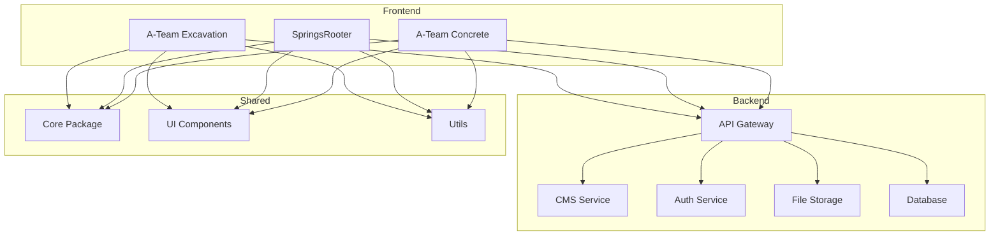

# A-Team Digital Platform

## Overview
This monorepo contains the digital platform for A-Team companies, starting with A-Team Excavation (a-team-x.com) and expanding to include SpringsRooter.com and A-Team Concrete in the future. The platform is designed to share core functionality while maintaining separate brand identities and content.

## Project Structure
```
.
├── README.md
├── DesignDocs.md              # Design documentation and guidelines
├── .cursor/                   # Cursor IDE settings and chat history
├── packages/                  # Shared packages
│   ├── core/                 # Core functionality and types
│   ├── ui/                   # Shared UI components
│   └── utils/                # Shared utilities
├── apps/                     # Individual applications
│   ├── a-team-excavation/    # A-Team Excavation website
│   ├── springs-rooter/       # SpringsRooter website (future)
│   └── a-team-concrete/      # A-Team Concrete website (future)
├── services/                 # Backend services
│   ├── cms/                 # Content Management System
│   ├── auth/                # Authentication service
│   └── api/                 # API Gateway
└── infrastructure/          # Infrastructure as code and configs
```

## System Architecture


## Technical Stack
### Backend
- **CMS**: Payload CMS (TypeScript-based)
- **API**: Node.js/TypeScript or .NET Core (TBD)
- **Database**: PostgreSQL
- **File Storage**: TBD (AWS S3 or similar)
- **Testing**: Jest for Node.js, xUnit for .NET

### Infrastructure
- **Containerization**: Docker
- **CI/CD**: GitHub Actions
- **Hosting**: TBD (AWS, Azure, or similar)
- **Monitoring**: TBD

## Development Guidelines
1. **TypeScript First**: All new code must be written in TypeScript
2. **Testing Requirements**:
   - Unit tests for all business logic
   - Integration tests for API endpoints
   - E2E tests for critical user flows
   - Minimum 80% test coverage for core packages
3. **Code Quality**:
   - ESLint + Prettier for code formatting
   - Husky for pre-commit hooks
   - Conventional Commits for version control
4. **Documentation**:
   - JSDoc for all public APIs
   - Storybook for UI components
   - API documentation with OpenAPI/Swagger

## Important Decisions & Discussions
### [Date: 2024-03-19]
- **Topic**: Monorepo Structure and Multi-Site Strategy
- **Decision**: Implement as a monorepo with shared packages and services
- **Rationale**: 
  - Code reuse across multiple sites
  - Consistent development experience
  - Simplified dependency management
  - Shared infrastructure and services
- **Key Considerations**:
  - Modular architecture for independent scaling
  - Shared authentication and user management
  - Common CMS for all sites
  - Separate content and branding per site
  - TypeScript for type safety and better developer experience

## Development Notes
- Current site: a-team-x.com (WordPress on DreamHost)
- Need to analyze current site structure and content before finalizing stack
- Consider migration strategy from WordPress to new platform
- Budget and hosting requirements to be determined
- Initial focus on A-Team Excavation, with architecture supporting future sites

## Getting Started
[To be added after stack finalization]

## Contributing
[To be added]

## License
[To be added] 